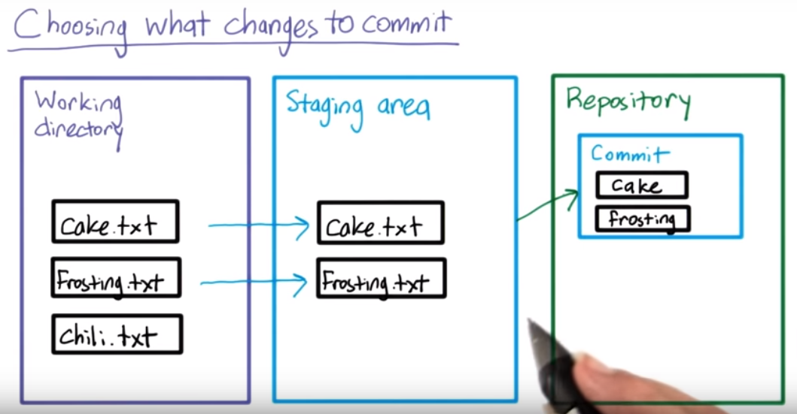

# 1. What makes a repository a repository? 
git repository stores lots of megadata of the history of the data and a hidden file `.git`

To show hidden files:
```
ls -a 
```
# 2. Initializing a repository
## Git repositories and directories
Each Git repository is tied to a specific directory - the directory where you ran git init. Only files from that directory (and subdirectories inside that directory) will be contained in that repository, and you can have different repositories in different directories.

Note: it's often the case that a Git repository in some directory will only contain, or track, some of the files in that directory, rather than all of them. You'll see how this works later this lesson.
Go to a folder to set up a new repository
```
git init
```
Use git status to track status of files
```
git status
```
# 3. Staging area

