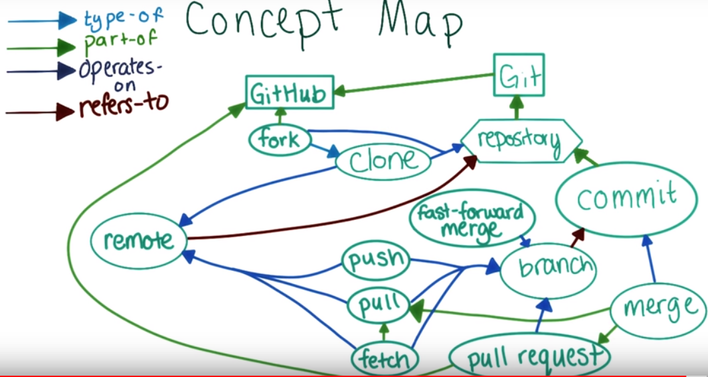

# 1. Syncing repositories
If you made changes on local folders and want to update github. Two ways:
1. Push through `Github Desktop` app
2. Use git bash
```
git push origin master
```

# 2. See remote repository
```
git remote -v
```
# 3. pulling changes
If you made changes on github and want to update local folders
```
git pull  
```

# 4. Add collaborator on Github
1. Go to project folder on Github
2. Go to settings
3. Click `collaborators`
4. Add github username
5. Click `Add collaborator` button

# 5. Git merge
You made some changes on your local file, and some changes on github

To merge all changes:
```
git pull origin master
```

If there are conflicts:
1. solve the conflict
2. use git add on conflicting files before committing
3. ```git commit```
4. ```git push```

# 6. Make a pull request
1. create a branch locally
```
git branch `branch_name`
```
2. make changes to a file or files and make a commit
3. push the branch to your fork or github repository
```
git push origin branch_name
```
4. create a pull request from the branch into master or other's repository
5. wait for response if it is other's repository or commit merge if it's your own repository.  

# 7. Concept map

