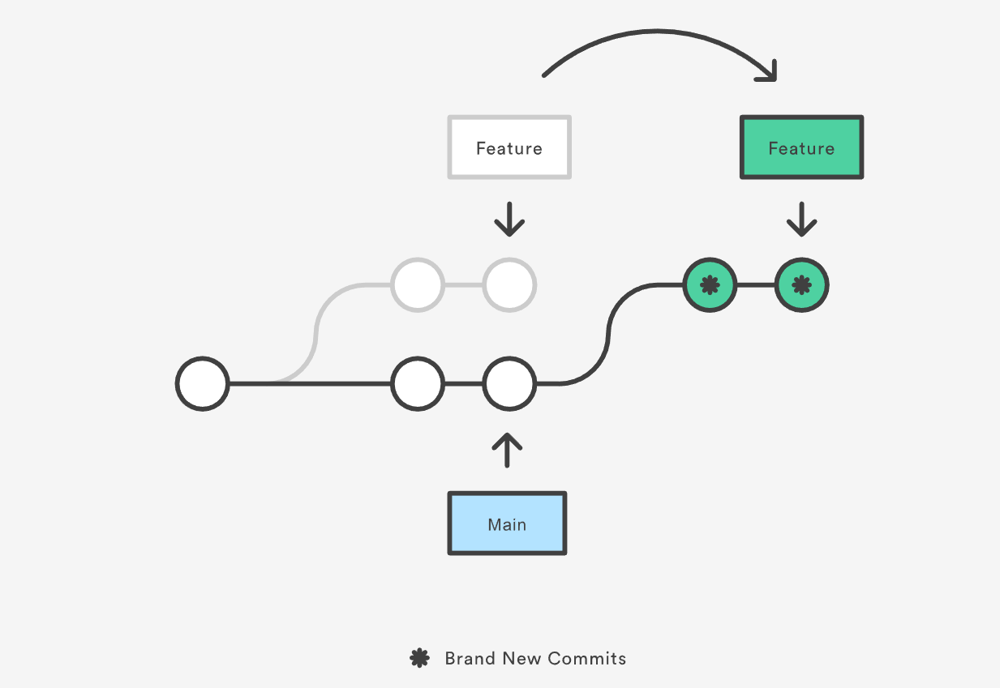

# Tutorial of working with existing remote repository
## Create local repository
1. Navigate to the desired online/remote repository
2. Click `Code`
3. Copy the url
4. In local folder, open `Git Bash`
5. Type `Git clone` and then paste the url
6. Press Enter
## Sync with the remote repository master branch
1. in local repository, type `git brach -a`  # this is to check the master branch name
2. Location line: `remotes/origin/Head ->` and note whatever is after `origin/`. 
3. If it's main then `git pull origin main`, or if it's master then `git pull origin master`
## Pull request
1. `git pull origin main` # to sync and update local repository
2. create a new branch by typing `git checkout -b side_branch_name`
3. make whatever changes 
4. `git status` to check the status, note the status message hints about what to do next
5. `git add .` adds / stages all of the files in the current directory. 
6. Commit the changes by `git commit -m "commit_message"`
**Note**: Never merge commit to master branch, always merge it to local side branch and pull request/
7. `git push origin side_branch_name`
8. navigate to online repository, click `Compare and Create pull request`
9. Leave a comment in the comment area, so the code manager and other collaberators know what this change is about
10. Click `Create pull request`
11. The appover will merge the side branch to the main branch

## Q&A
**I had two branches: master and branch1. I just merged branch1 back into master and I'm done with that branch. Should I delete it or just let it sit around? Will deleting it cause any loss of data?**

After the merge, it's safe to delete the branch:

`git branch -d branch1`

Additionally, git will warn you (and refuse to delete the branch) if it thinks you didn't fully merge it yet. If you forcefully delete a branch (with `git branch -D`) which is not completely merged yet, you have to do some tricks to get the unmerged commits back though (see below).

There are some reasons to keep a branch around though. For example, if it's a feature branch, you may want to be able to do bugfixes on that feature still inside that branch.

If you also want to delete the branch on a remote host, you can do:

`git push origin :branch1`
This will forcefully delete the branch on the remote (this will not affect already checked-out repositiories though and won't prevent anyone with push access to re-push/create it).

git reflog shows the recently checked out revisions. Any branch you've had checked out in the recent repository history will also show up there. Aside from that, git fsck will be the tool of choice at any case of commit-loss in git.

**As a repository owner, you got a user who made a few commits and rolled them into one pull request. You want to accept one of the commits, but reject the others. Is this possible with GitHub?**

Next to the `Merge pull request` button, there should be a `Use the command line` link to instructions on how to do it manually. You should follow these instructions (create new local branch and pull in their changes), but then instead of merging that whole branch back into master, you just cherry-pick the commits you want.

e.g. to review a pull request from user: jashkenas, in their branch: new-feature
```
git checkout -b jashkenas-new-feature master
git pull https://github.com/jashkenas/YOUR_REPO_NAME.git new-feature
```
And then do your testing, and then when you're ready:
```
git checkout master
git cherry-pick COMMIT_HASH_1
git cherry-pick COMMIT_HASH_2
# etc
git push origin master
```

## What is git rebase?
Rebasing is the process of moving or combining a sequence of commits to a new base commit. Rebasing is most useful and easily visualized in the context of a feature branching workflow. The general process can be visualized as the following:


## Resolve git conflict when merging
[6:08 PM] Ding, John GSUSI-PTX/C/R
Hi Saad

[6:08 PM] Ding, John GSUSI-PTX/C/R
If you cloned an earlier version of the main branch, created a new branch, and made some commits on that branch, but the main branch has since been updated with new changes, then your branch is now out of date and will need to be updated before you can merge your changes back into the main branch without conflicts.Here are the steps you can follow to update your branch and avoid conflicts:
1. First, switch back to the main branch using the command git checkout main.
2. Pull the latest changes from the remote main branch using the command git pull.
3. Switch back to your branch using the command git checkout <your-branch-name>.
4. Merge the changes from the updated main branch into your branch using the command git merge main.
5. Resolve any conflicts that may arise during the merge process.
6. Once the conflicts have been resolved, commit the changes using the command git commit -m "Merge changes from main branch".
7. Finally, push your changes to the remote repository using the command git push.
After completing these steps, your branch will be up to date with the latest changes from the main branch, and you should be able to merge your changes back into the main branch without conflicts.


